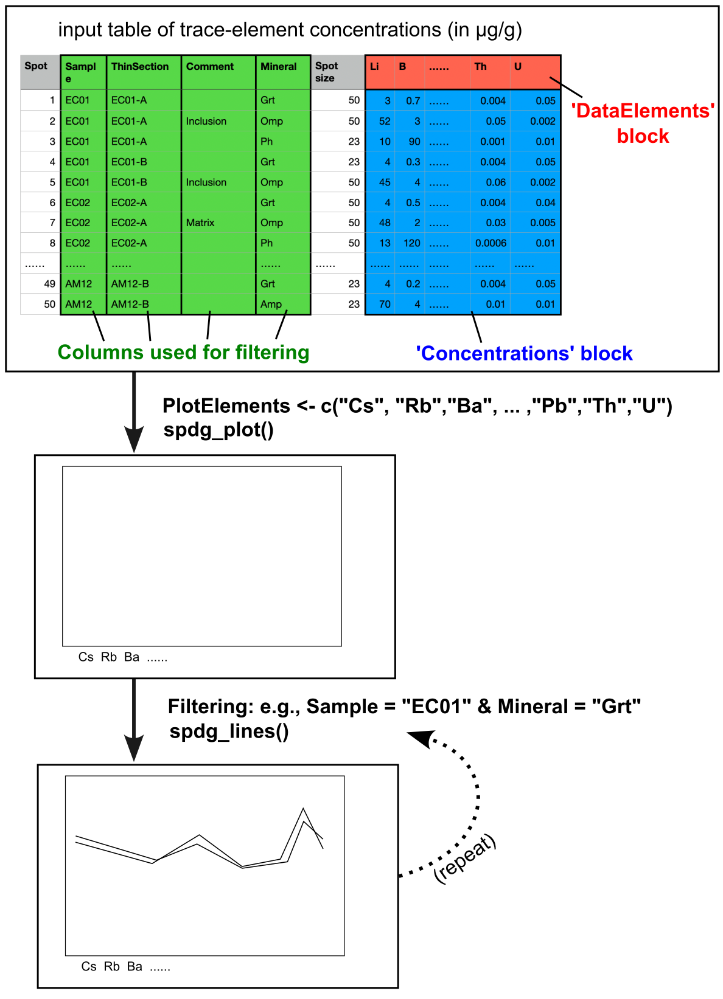

# spdgmake

<!-- badges: start -->
<!-- badges: end -->

**spdgmake** is the R package for plotting spider diagrams (used in geochemistry).

**spdgmake**は、スパイダーダイアグラム（地球化学で用いられるプロット）を描画するためのRパッケージです。

## Installation

You can install this package from [GitHub](https://github.com/) with:

``` r
# install.packages("remotes")
remotes::install_github("Ryo-fkushima/spdgmake")
```

## Graphical abstract: how to use



(1) prepare a dataset of trace-element concentrations (as a csv file); 

(2) define each 'block' for further data processing (i.e., Concentrations, DataElements, columns for filtering);

(3) choose plotting elements and filtering conditions; and 

(4) draw spider diagrams.

You can repeat steps (3)–(4) with different filtering conditions to compare data of different samples and/or minerals. 


## Example

``` r
library(spdgmake)

# load concentration data
data <- spdgmake_testdata

# define concentration matrix (as a numeric type dataframe)
Concentrations_original <- data[,4:ncol(data)]
Concentrations <- as.data.frame(apply(Concentrations_original, c(1,2), as.numeric))

# define the element list presented in the input data
DataElements <- colnames(data)[4:ncol(data)]

# set the element list whose concentrations you want to plot
PlotElements <- c("Cs", "Rb","Ba", "Pb", "Sr","La","Nd","Sm","Eu","Gd","Dy","Yb","Lu","Hf","Ta","Y","Zr","Nb","Th","U")

# generate the plot area
spdg_plot(PlotElements, -3, 3, 0.85)

# define the filter
# Note: since spdgmake_testdata only contains 1 observation, filtering is not required in this case.
# But [Sample, Phase, Comment1, Comment2] must be defined here by choosing a given column as the formal 'column for filtering'

Sample <- as.data.frame(data[,"Type"])   
Phase <- as.data.frame(data[,"Type"])
Comment1 <- as.data.frame(data[,"Type"])
Comment2 <- as.data.frame(data[,"Type"])

filtering <- spdg_filter_make(Sample, Phase, Comment1, Comment2, Sample_value = NA, Phase_value = NA, Comment1_value = NA, Comment2_value = NA) # NA means no filtering is applied. If you want to apply filtering, NA should be replaced with some value.

# draw spider diagrams
spdg_lines(PlotElements, DataElements, Concentrations, filtering, NMORB_SM89, "black")

# save processed data
# ProcessedData <- spdg_plotdata_export(PlotElements, DataElements, Concentrations, filtering, NMORB_SM89, Output = FALSE)

```

## Requirement

R >= 3.5

## Author

Ryo Fukushima (rpifukushima@gmail.com)

## Updates

May 07, 2025: v0.1.0 was released.

